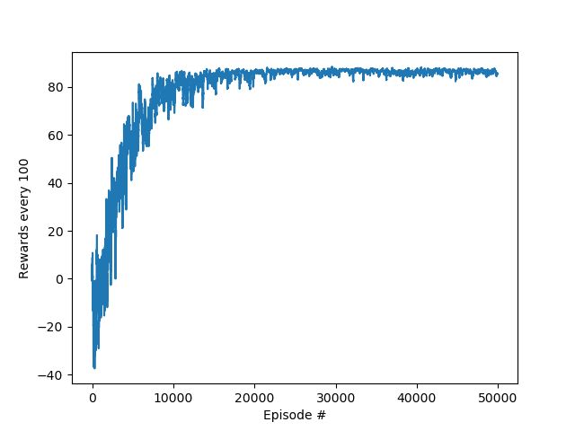

# Tic Tac Toe AI Agent
AI agent trained to play tic tac toe using reinforcement learning (q learning). 
Environment (env.py) creates a tic tac toe game with 2 users using object oriented programming. We then define the q table as a dictionary with key - value pairs being the states - q values pairs. Then, using the q learning algorithm, we train the agent for 50,000 episodes and track the rewards.

## Training rewards (moving average every 100 episodes)



## Agent goals
We need a player class which represents our agent, and the player is able to:
 * Choose actions based on current estimation of the states
 * Record all the states of the game
 * Update states-value estimation after each game
 * Save and load the q table
## Parameters
```
Training = 50000 
epsilon = 0.9
DISCOUNT = 0.95
EPS_DECAY = 0.9998
WIN_REWARD = 100
LOSE_REWARD = -200
TIE_REWARD = 50
CHANCE_PENALTY = -1
SHOW_EVERY = 100
LEARNING_RATE = 0.1

```

## Q Table Initialisation
Q Table is a dictionary with all possible states as the keys and q values for each possible action as a list.
```
if q_table is None:
    q_table = {}
    strings = ['X--------', 'XO-------', 'XXO------', 'XXOO-----', 'XXXOO----', 'XXXOOO---', 'XXXXOOO--', 'XXXXOOOO-', 'XXXXXOOOO']
    states = ['---------']
    for i in strings:
        p = permutations(i)
        for j in list(p):
            stringA = ''.join(j)
            if stringA not in states:
                states.append(stringA)
    print('Number of states:',len(states))
    values = []
    for i in states:
        value = list(np.random.uniform(-5,0,size=9))
        for index,j in enumerate(i):
            if j == 'X' or j == 'O':
                value[index] = None
        values.append(value)

    for i in range(len(states)):
        q_table[states[i]] = values[i]


    with open('QTable.pickle', 'wb') as handle:
        pickle.dump(q_table, handle, protocol=pickle.HIGHEST_PROTOCOL)

```

## Game object
Defined in Board.py, contains class methods for taking chances, printing current state and deciding the winner or if it is a tie.
